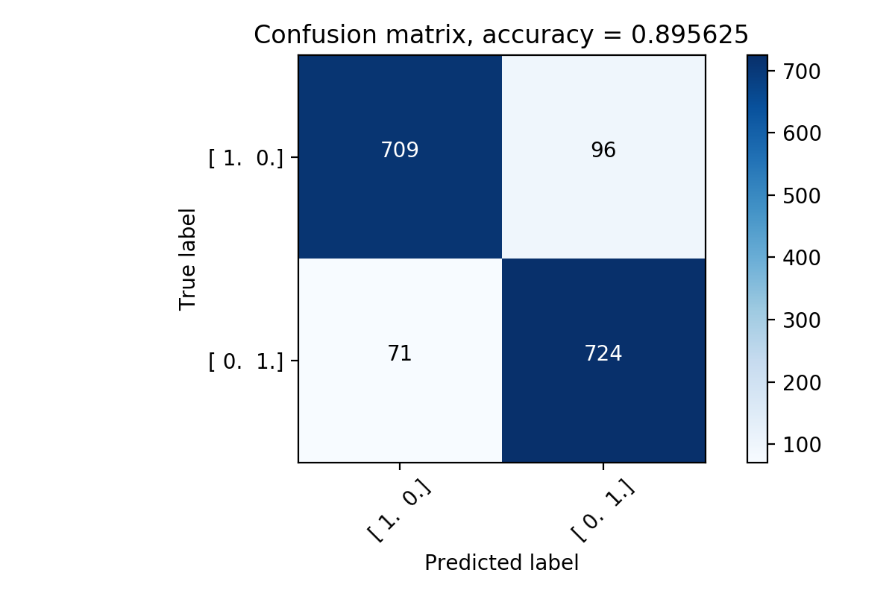
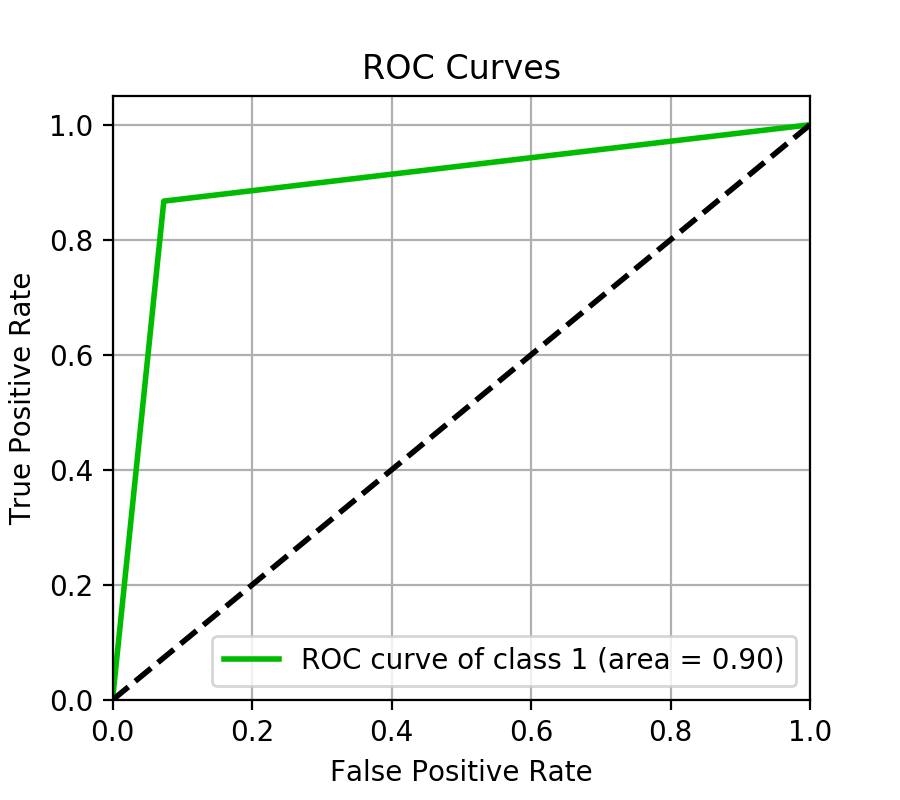
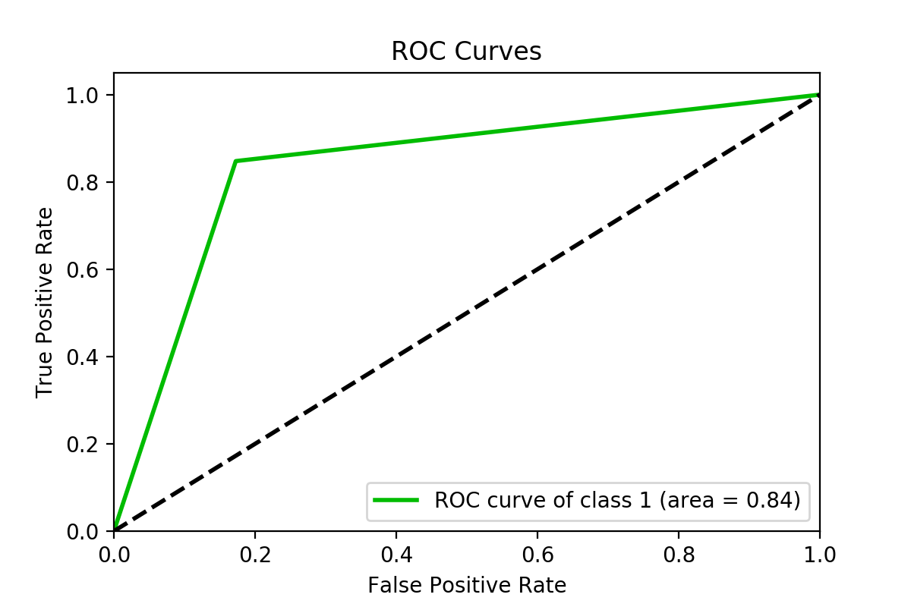
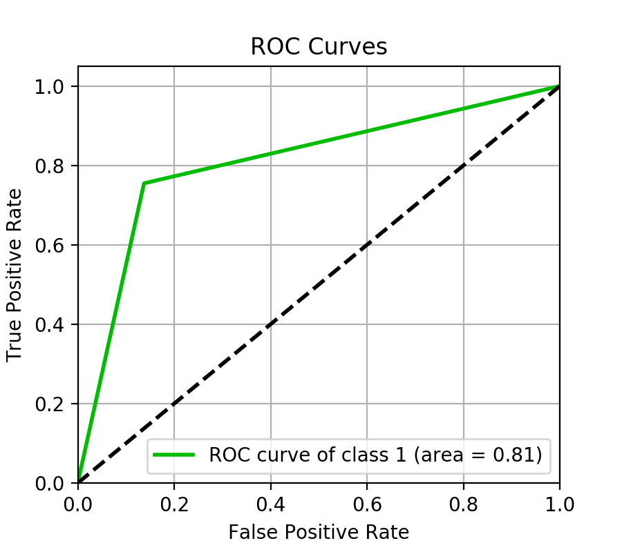
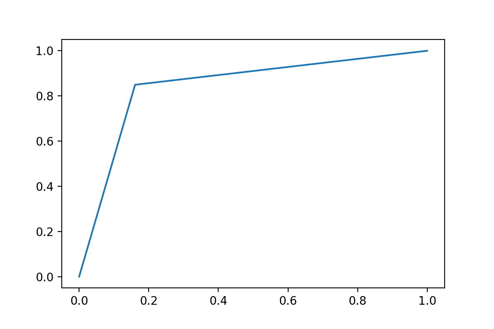
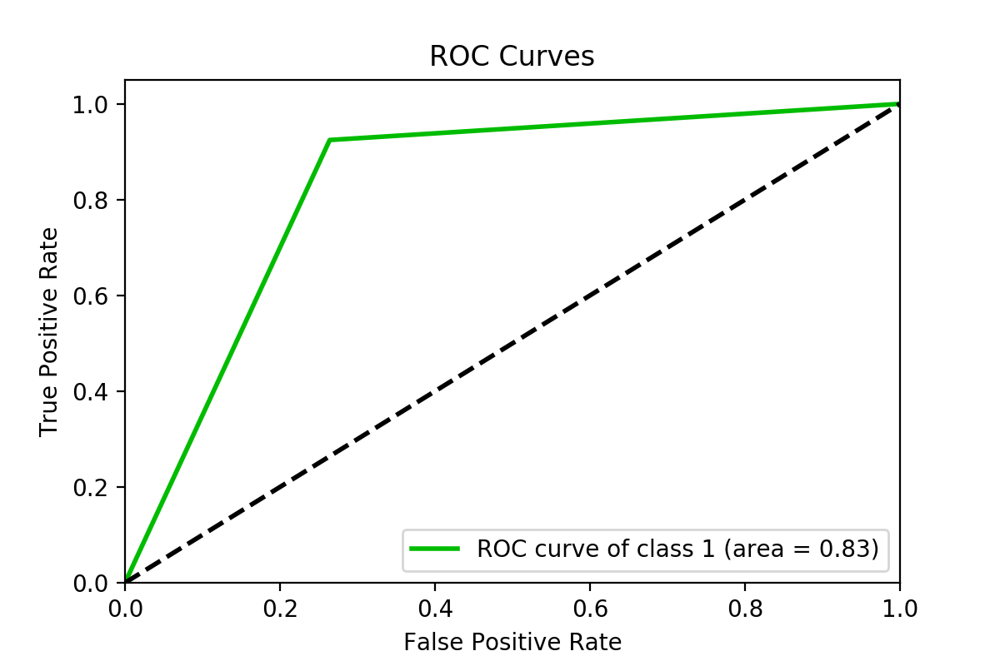

Темпорализация |Синтетические данные    (sklearn.datasets)  | Реальные данные   (Heart Disease UCI dataset from kaggle.com)
:------- | :----: | :----: 
Без темпорализации  |  |   
Две первые по *importance*  | |right
Первая и последняя  |  |right
По-порядку *importance* |  |right
В обратном порядке *importance*|  |right
Все в случайном порядке|  |right

#width="500" height="00"
