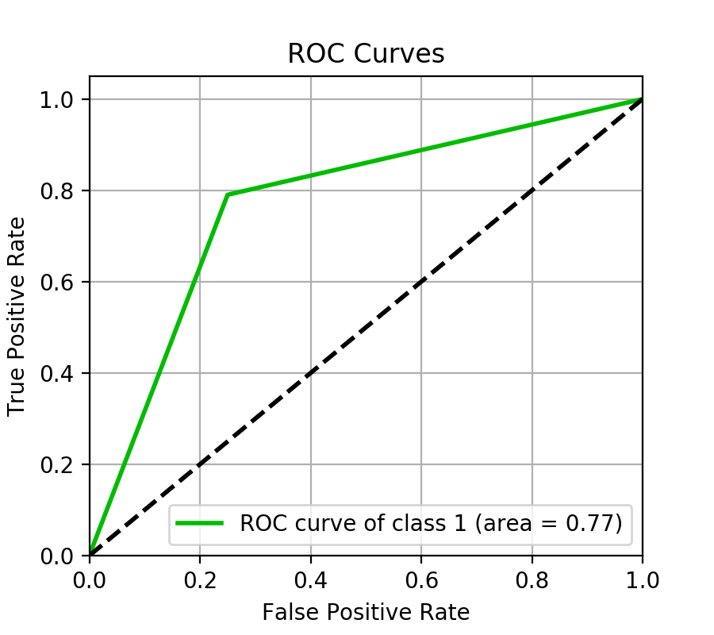
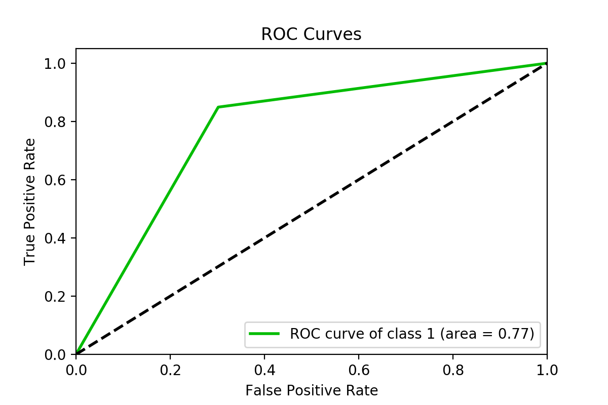
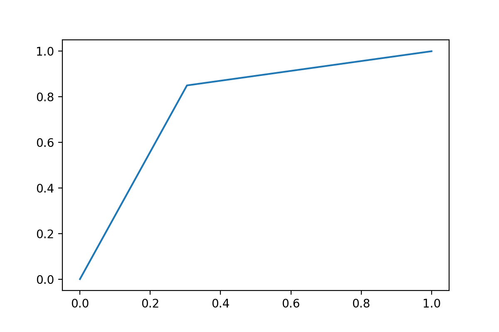
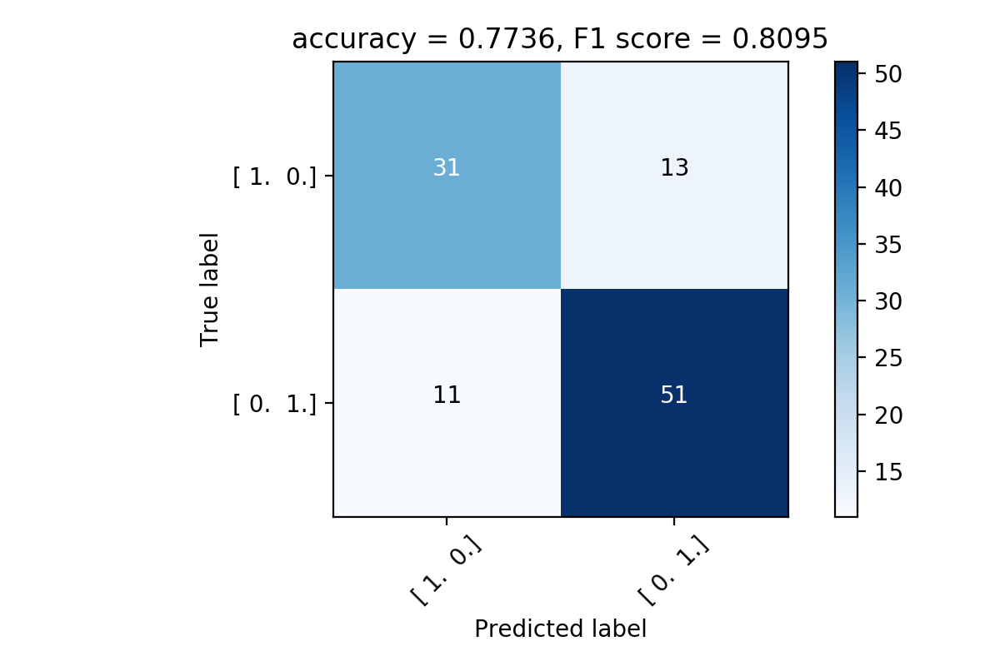
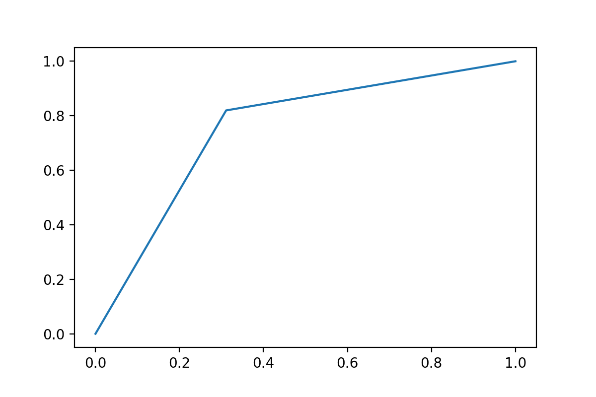
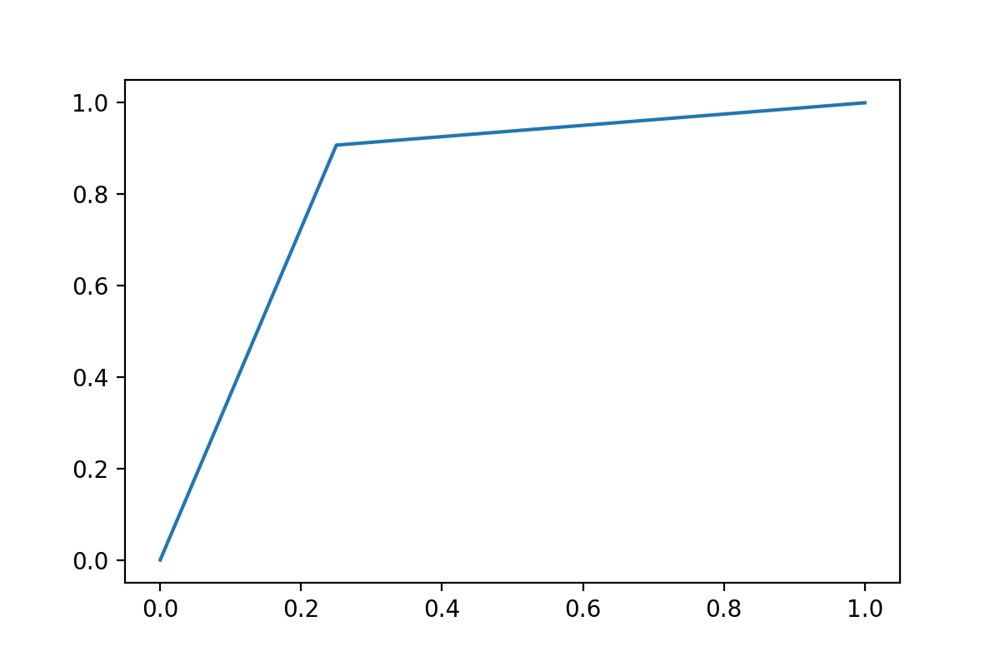
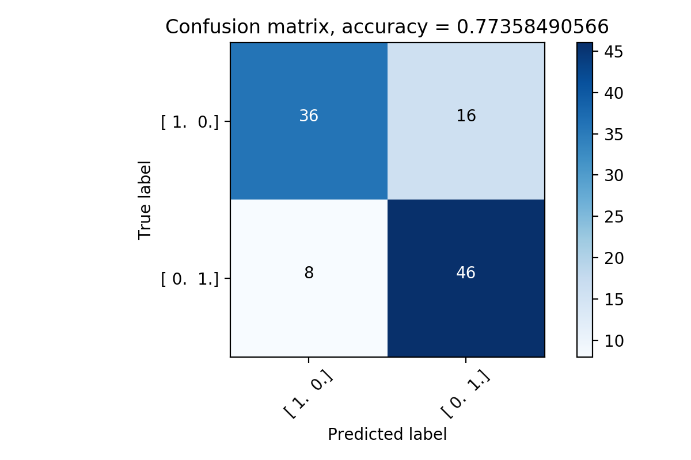
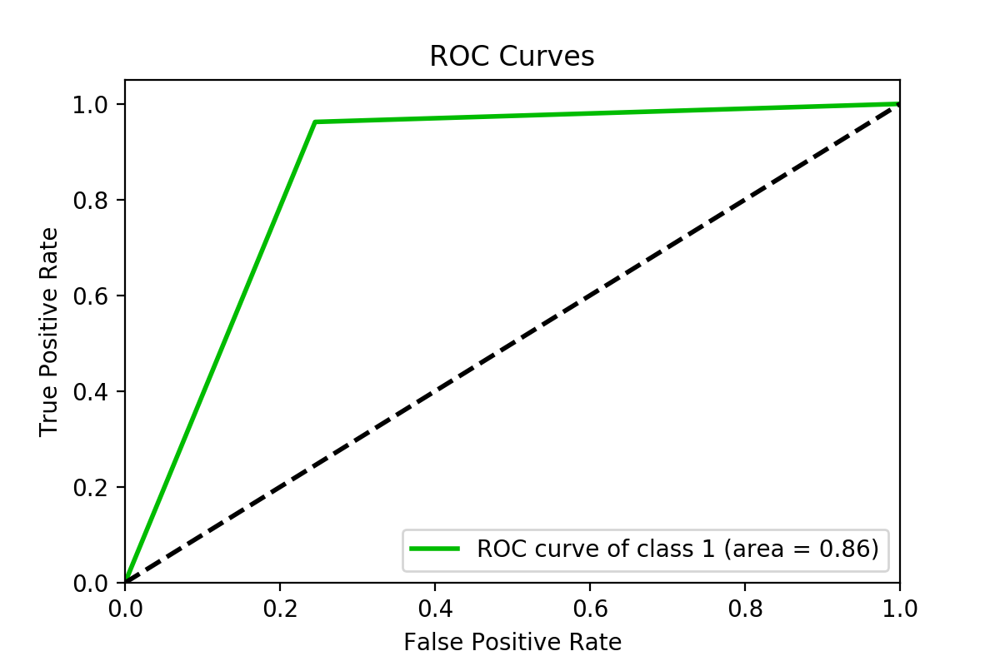

# Зависимость ESN-cети от темпорализации данных

Темпорализация |Синтетические данные    (sklearn.datasets)  | Реальные данные   (Heart Disease UCI dataset from kaggle.com)
:------- | :----: | :----: 
Без темпорализации  |  |   
Две первые по *importance*  | | 
Первая и последняя  |  | 
По-порядку *importance* |  | 
В обратном порядке *importance*|  | 
Все в случайном порядке|  | 

#width="500" height="400"
